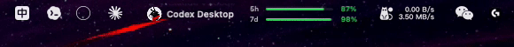

<h1>Donvis</h1>

<b>See your Codex & Claude Code account usage at a glance</b>

Lives in the macOS menu bar, automatically detects the official client you're using, and shows your account-level <code>5-hour / 7-day</code> remaining quota in real time.

  
  
  
  
  

<a href="README.md">简体中文</a> · <b>English</b>

---

## ✨ What is it

**Donvis** is a local usage monitor built for **Codex** and **Claude Code** users.

No more opening web dashboards, typing commands, or sending a throwaway message first — just open the menu bar and **whichever client you're using shows up with its remaining quota**. Clean and direct.

## 🚀 Key Features

- **🔌 Instant display** — Open it and your current quota is right there. No need to send a message first, no manual trigger — the same experience as the official clients.
- **🧭 Smart client detection** — Automatically distinguishes Codex Desktop, Codex CLI, the Codex VSCode extension, Claude Desktop, and Claude Code CLI. **Whatever is open shows up; close it and it disappears.**
- **📊 Account-level 5h / 7d dual windows** — Shows remaining percentage and reset time for both the 5-hour session window and the 7-day rolling window, so you're never caught off guard.
- **👥 Shared-account merging** — When one account is signed in across multiple clients, Donvis clearly labels it as a shared quota instead of pretending there are several separate allowances.
- **🗂 Clean grouped ordering** — Codex clients and Claude clients are grouped together, with the one you're actively using floating to the top.
- **🔁 Multi-client rotation** — When several clients are online, the menu-bar title rotates between them with a 3D page-flip animation.
- **🔄 Real Claude manual refresh** — Clicking Refresh bypasses the local cache and requests Claude Code account usage directly; if the service returns no fresh quota, Donvis keeps the last valid reading and tells you why.
- **🛡 Safe Claude data source** — Donvis does not scrape Claude Desktop cookies or reverse-engineer private web sessions; it only uses the local Claude Code credential path and the official statusLine bridge.
- **🪟 Dock fallback** — If macOS hides the menu-bar icon for space, open the same status window from the Dock.
- **🖥 Consistent across displays** — The popup looks and behaves the same on your main and secondary screens.

## 🎬 Feature Tour

### 🔁 Smart menu-bar rotation

The menu-bar title **rotates automatically** across every online client — `Claude Code CLI`, `Codex VSCode`, `Claude Desktop`, `Codex CLI`, and so on — each shown with its own `5h / 7d` progress bars and percentages, with a 3D page-flip animation between them. Prefer a fixed view? Pin it to a single client or switch manually in Settings.

### 🪟 One-click overview popup

Click the menu-bar icon for a **card-style overview** that shows everything at once:

- Current client name and connection status (connected / waiting)
- Source label (account login · official client / VSCode extension), account email, subscription tier
- A "shared quota" note when multiple clients use the same account
- `5-hour` and `7-day` remaining percentages, reset times, and last-updated time
- A clear warning when Claude does not return fresh usage and Donvis is showing the last valid reading
- Codex and Claude clients grouped separately, never interleaved
- Quick actions at the bottom: Refresh / Settings / Quit

### ⚙️ Flexible settings

Tune the display to your workflow:

- **Display mode**: Auto / Codex only / Claude only / multi-client rotation
- **Rotation interval**: customize how fast the menu-bar title cycles
- **Launch at login**: start automatically when you sign in
- **Low-quota alerts**: get a system notification when remaining quota runs low
- Menu-bar style and display preferences

### 🧰 Dock fallback entry

When macOS hides the menu-bar icon for lack of space, open the same status window straight from the **Dock icon** — current quota, account info, source, and settings, identical to the menu-bar popup.

## 🔒 Privacy first

Donvis only reads the minimum needed to display your quota, and **never touches your code or conversations**:

- Does not scrape web cookies.
- Does not scrape Claude Desktop cookies or inject into private web sessions.
- Does not read plaintext API keys from your IDE.
- Does not upload any quota, account, or local configuration data.
- Does not store prompts, model responses, code, or file contents.

## 📦 Download & Install

| Chip | Installer |
| --- | --- |
| Apple Silicon (M-series) | [Donvis-1.7.0-macOS-arm64.dmg](macOS/Donvis-1.7.0-macOS-arm64.dmg) |
| Intel Mac | [Donvis-1.7.0-macOS-x86_64.dmg](macOS/Donvis-1.7.0-macOS-x86_64.dmg) |

Pick the installer matching your Mac's chip — both builds are functionally identical.

**Steps:**

1. Download and open the DMG, then drag `Donvis.app` into Applications.
2. If Gatekeeper blocks the first launch (the build is ad-hoc signed and not Apple-notarized): right-click the app → **Open**, or go to **System Settings → Privacy & Security** and click **Open Anyway**.
3. Alternatively, run `xattr -dr com.apple.quarantine /Applications/Donvis.app` in Terminal, then launch.

> A Windows build is not yet available; it will land in [`Windows/`](Windows/) in a future release.

## 💻 Requirements

- macOS 13 Ventura or later
- Apple Silicon or Intel Mac
- For Codex: Codex Desktop, Codex CLI, or the official VSCode extension installed
- For Claude Code: Claude Desktop or Claude Code CLI installed and signed in

## 📄 License

[MIT License](LICENSE)
