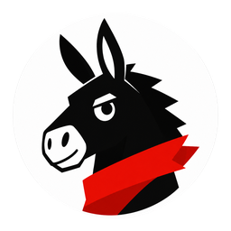

<h1>Donvis</h1>

<b>一眼看清 Codex 与 Claude Code 的账号额度</b>

常驻 macOS 菜单栏，自动识别正在使用的官方客户端，实时展示账号级 <code>5 小时 / 7 天</code> 剩余额度。

  
  
  
  
  

<b>简体中文</b> · <a href="README.en.md">English</a>

---

## ✨ 这是什么

**Donvis** 是一款专为 **Codex** 和 **Claude Code** 用户打造的本地额度监控工具。

不用再打开网页后台、不用敲命令、更不用先发一条消息——打开菜单栏，**你正在用哪个客户端，就显示哪个客户端的剩余额度**，干净直接。

## 🚀 核心特性

- **🔌 即开即显** — 点开就能看到当前额度，无需先发消息、无需手动触发刷新，体验与官方客户端一致。
- **🧭 智能识别在用客户端** — 自动区分 Codex Desktop、Codex CLI、Codex VSCode 扩展、Claude Desktop、Claude Code CLI；**开了哪个显示哪个，关掉即消失**。
- **📊 账号级 5h / 7d 双窗额度** — 同时展示 5 小时会话窗口与 7 天周窗口的剩余百分比和重置时间，额度见底前心里有数。
- **👥 共享账号智能合并** — 同一账号在多个客户端登录时，会明确标注「共享额度」，不会误以为有好几套独立配额。
- **🗂 清爽分组排序** — Codex 系与 Claude 系各自聚拢，正在使用的那一组自动置顶，列表一目了然。
- **🔁 多客户端轮播** — 多个客户端同时在线时，菜单栏标题自动轮播切换，配 3D 翻页动画。
- **🪟 Dock 备用入口** — 菜单栏被系统挤掉时，可从 Dock 打开同款状态窗口。
- **🖥 主屏副屏一致体验** — 无论在哪块屏幕，弹窗展示都保持一致。

## 🔒 隐私优先

Donvis 只读取展示额度所必需的最小信息，**绝不碰你的代码和对话**：

- 不抓取网页 Cookie。
- 不读取 IDE 中的 API Key 明文。
- 不上传任何额度、账号或本地配置。
- 不保存 Prompt、模型响应、代码或文件内容。

## 📦 下载安装

| 芯片 | 安装包 |
| --- | --- |
| Apple Silicon (M 系列) | [Donvis-1.4.0-macOS-arm64.dmg](macOS/Donvis-1.4.0-macOS-arm64.dmg) |
| Intel Mac | [Donvis-1.4.0-macOS-x86_64.dmg](macOS/Donvis-1.4.0-macOS-x86_64.dmg) |

请选择与你的 Mac 芯片一致的安装包，两个版本功能完全相同。

**安装步骤：**

1. 下载并打开 DMG，把 `Donvis.app` 拖入「应用程序」。
2. 首次启动若被 Gatekeeper 拦截（当前为 ad-hoc 签名，未经 Apple 公证）：右键点击 App → 选择「打开」，或前往「系统设置 → 隐私与安全性」点击「仍要打开」。
3. 也可在终端执行 `xattr -dr com.apple.quarantine /Applications/Donvis.app` 后再启动。

> Windows 版本暂未发布，后续会放入 [`Windows/`](Windows/) 目录。

## 🖼 功能展示

Donvis 在菜单栏展示当前客户端名称及账号级 `5h / 7d` 剩余额度，多客户端在线时自动轮播。

## 💻 系统要求

- macOS 13 Ventura 或更高版本
- Apple Silicon 或 Intel Mac
- 使用 Codex：需安装 Codex Desktop、Codex CLI 或官方 VSCode 扩展
- 使用 Claude Code：需安装 Claude Desktop 或 Claude Code CLI 并完成登录

## 📄 License

[MIT License](LICENSE)
