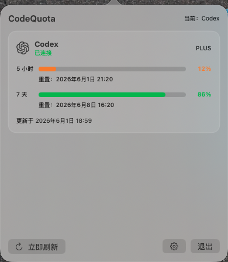
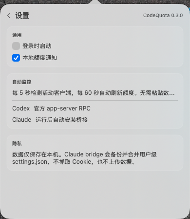

# Donvis

Donvis 是一款面向 Codex 与 Claude Code 用户的本地额度监控工具。macOS 版本以菜单栏应用运行，可识别当前活动客户端并展示账号级 `5h / 7d` 剩余额度。

## 下载

当前稳定版本：`V1.0.0`

- macOS Universal DMG：[Donvis-1.0.0-macOS-universal.dmg](macOS/Donvis-1.0.0-macOS-universal.dmg)
- Windows：尚未发布，后续文件将放入 [`Windows/`](Windows/)

macOS 安装包同时支持 Apple Silicon 与 Intel Mac。

## 安装

1. 下载并打开 DMG。
2. 将 `Donvis.app` 拖入“应用程序”目录。
3. 从“应用程序”目录启动 Donvis。

当前公开安装包使用 ad-hoc 签名，尚未经过 Apple Developer ID 公证。首次启动时，如果 macOS 阻止打开：

1. 打开“系统设置”。
2. 进入“隐私与安全性”。
3. 在安全性区域找到 Donvis 提示。
4. 点击“仍要打开”。

也可以在 Finder 中右键点击 `Donvis.app`，选择“打开”并确认。

## 功能

- 自动识别 Codex Desktop、Codex CLI 和 VSCode 官方 Codex 扩展。
- 识别 Claude Code CLI，并通过官方 `statusLine` 桥接获取额度。
- 菜单栏展示账号级 `5h / 7d` 剩余额度。
- 多客户端同时在线时分别展示卡片，并明确共享账号额度。
- 无有效客户端时，菜单栏显示“未连接”。
- 支持 VSCode、Cursor、Trae 和 JetBrains 客户端接入检测。
- 内置本地 Gateway，为 API Key 模式提供精确 Token 统计。
- Universal Binary：同时支持 `arm64` 与 `x86_64`。

## 功能预览

### 菜单栏额度

菜单栏使用紧凑进度条展示 `5h / 7d` 剩余额度。没有有效客户端时显示“未连接”。


### 额度详情

点击菜单栏图标后，可以查看当前客户端、登录账号、共享额度、重置时间和更新时间。



### 设置与客户端接入

设置页提供自动监控、通知、客户端接入和本地 Gateway 配置入口。



## 客户端说明

### Codex

Donvis 使用官方 `codex app-server` RPC 读取登录账号和额度：

- `account/read`
- `account/rateLimits/read`

Codex Desktop、Codex CLI 和 VSCode 官方扩展共享同一账号时，会显示相同账号额度，不会误标为多套独立配额。

### Claude Code

Donvis 使用 Claude Code 官方 `statusLine` 能力，不调用 Claude Desktop 私有接口。桥接缓存位于：

```text
~/Library/Application Support/Donvis/claude-statusline.json
```

如果仅运行 Claude Desktop、尚未产生 Claude Code 会话响应，Donvis 会提示需要在 Claude Code 会话中更新额度。

## IDE 与 Gateway

Donvis 内置 Gateway，固定监听：

```text
127.0.0.1:4099
```

支持端点：

- `GET /health`
- `GET /v1/models`
- `POST /v1/chat/completions`
- `POST /v1/responses`
- `POST /v1/messages`

API Key 模式客户端可以将 Base URL 配置为 `http://127.0.0.1:4099/v1`，并使用 Donvis 生成的 Local Key。真实上游 API Key 仅写入 macOS Keychain。

## 隐私

- 不抓取网页 Cookie。
- 不读取 IDE 中的 API Key 明文。
- 不保存 Prompt、响应正文、代码或文件内容。
- 不上传额度、账号或本地配置。
- Gateway 仅监听本机回环地址。
- Gateway 默认只记录模型、端点、Provider、客户端、请求 ID、Token 数、状态码、耗时、限流响应头和时间戳。

## 系统要求

- macOS 13 Ventura 或更高版本。
- Apple Silicon 或 Intel Mac。
- 使用 Codex 时，需要安装 Codex Desktop、Codex CLI 或 VSCode 官方扩展。
- 使用 Claude Code 时，需要安装 Claude Code CLI。

## 从源码构建

开发环境需要 Swift 5.9 或更高版本：

```bash
swift build
Scripts/package_distribution.sh
```

构建结果：

```text
build/Donvis.app
dist/Donvis-1.0.0-macOS-universal.dmg
dist/Donvis-1.0.0-macOS-universal.zip
```

验证 Universal Binary：

```bash
lipo -info build/Donvis.app/Contents/MacOS/Donvis
```

仅安装 Command Line Tools 的环境可能缺少 `XCTest` 模块。完整测试建议使用完整 Xcode 工具链。

## 仓库结构

- [`macOS/`](macOS/)：macOS 安装包。
- [`Windows/`](Windows/)：预留 Windows 安装包目录。
- [`Packages/`](Packages/)：发布包说明。GitHub Packages 注册表将在提供对应包格式后启用。

## License

[MIT License](LICENSE)
