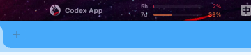

# Donvis

Donvis 是一款面向 Codex 与 Claude Code 用户的本地额度监控工具。它以 macOS 菜单栏应用运行，自动识别当前活动的官方客户端，并展示账号级 `5h / 7d` 剩余额度。

当前版本：`V1.3.0`

## 下载

- Apple Silicon：[Donvis-1.3.0-macOS-arm64.dmg](macOS/Donvis-1.3.0-macOS-arm64.dmg)
- Intel Mac：[Donvis-1.3.0-macOS-x86_64.dmg](macOS/Donvis-1.3.0-macOS-x86_64.dmg)
- Windows：暂未发布，后续版本会放入 [`Windows/`](Windows/)

请选择与你的 Mac 芯片一致的安装包。两个版本功能相同，但分别只包含对应架构。

## 功能亮点

- 自动识别 Codex App、Codex CLI、Codex VSCode 官方扩展。
- 支持 Claude Code CLI 额度展示。
- 菜单栏展示账号级 `5h / 7d` 剩余额度。
- 多客户端同时在线时，按客户端轮播展示。
- 支持 3D 上下翻页式工具栏切换动画。
- Dock 入口可作为菜单栏拥挤时的备用入口。
- 支持主屏、副屏一致的菜单栏弹窗体验。
- 不读取 IDE 中的 API Key 明文，不保存 Prompt、响应正文、代码或文件内容。

## 功能展示

### 菜单栏额度轮播

Donvis 会在菜单栏展示当前客户端名称，以及账号级 `5h / 7d` 剩余额度。多个客户端在线时会自动轮播。

### 客户端识别

Donvis 可以区分不同接入来源，例如：

- Codex App
- Codex CLI
- Codex VSCode
- Claude Code CLI

同一账号在多个客户端登录时，Donvis 会明确展示这些客户端共享同一个账号额度，避免误认为存在多套独立配额。

### Dock 状态窗口

当菜单栏图标因系统空间不足被隐藏时，可以通过 Dock 图标打开 Donvis 状态窗口。窗口会展示当前额度、账号信息、来源说明和设置入口。

## 隐私

- 不抓取网页 Cookie。
- 不读取 IDE 中的 API Key 明文。
- 不上传额度、账号或本地配置。
- 不保存 Prompt、响应正文、代码或文件内容。

## 系统要求

- macOS 13 Ventura 或更高版本。
- Apple Silicon 或 Intel Mac。
- 使用 Codex 时，需要安装 Codex App、Codex CLI 或 VSCode 官方 Codex 扩展。
- 使用 Claude Code 时，需要安装 Claude Code CLI。

## License

[MIT License](LICENSE)
